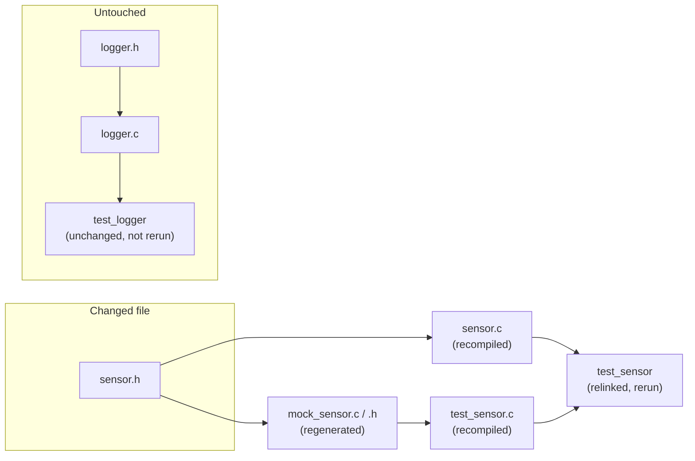
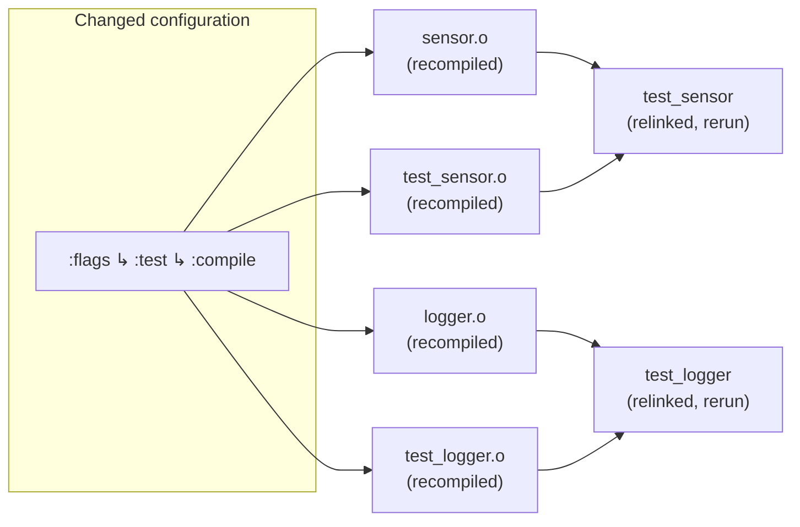

# Ceedling’s Delta Builds

Like many source build systems, Ceedling seeks to avoid unnecessary actions when nothing in a project has changed.

Ceedling’s delta builds are automatic. No configuration is needed.

!!! tip
    Fully clean builds can be triggered by first running `ceedling clobber`.

## Delta build overview

Ceedling builds and maintains a cache and a dependency tree to avoid unnecessary file generation, toolchain actions (preprocessing, compiling, linking), and running of test fixtures.

The checks in the dependency tree are content based, not timestamp based, and include:

1. **File content changes.** Did an antecedent of a build target change? That is, did a file that other build targets are dependent on change and, thus, require that the target be rebuilt?
2. **Configuration changes.** Did a build target’s project configuration change? That is, even if all files remain unchanged, did a project configuration change impact one or more build targets?

Ceedling builds the dependency graph for you from two sources:

1. Dependency files generated by compilation. The toolchain’s search paths and “spidering” among files during compilation produces a dependency graph as a side effect. Ceedling captures this and uses it to understand the relationships among your C files to trigger rebuilds.
2. Its own understanding of your project through the lens of its build pipeline. In test builds, Ceedling and its supporting frameworks generate various files from various sources. Ceedling’s built-in understanding of those file generation relationships also drive individual file target rebuilds.

Where a C file change ripples out only along that file’s dependency chain, a shared configuration change ripples out across every target that reads that piece of configuration — often the whole project. File changes tend to trigger depth-oriented rebuilds while configuration changes tend to trigger breadth-oriented rebuilds.

## Delta build examples

Say a project has a `sensor` module (`sensor.c` / `sensor.h`) and a `logger`
module (`logger.c` / `logger.h`), each with its own test file. `test_sensor.c`
mocks `sensor.h` while `test_logger.c` has nothing to do with `sensor.h` at all.

### Header file change

You add a new function prototype to `sensor.h`. On the next build, Ceedling
walks its dependency graph and finds every target that lists `sensor.h` as an
antecedent:

- `mock_sensor.c` / `mock_sensor.h` — regenerated, since the mock is derived
  from `sensor.h`’s contents.
- `sensor.c` — recompiled, since it includes `sensor.h` directly.
- `test_sensor.c` — recompiled, since it also includes `sensor.h`
  (via the mock).
- `test_sensor` executable — relinked and rerun, since its objects changed.

`logger.c` and `test_logger.c` never reference `sensor.h`. Nothing about them
changed. Ceedling leaves that whole chain untouched and doesn’t rebuild or
rerun `test_logger` but will report its cached test results.

### Configuration change

Now say you add a a new warning flag under `:flags ↳ :test ↳ :compile` in 
your Ceedling project configuration. No source file changed at all.

A compile flag is part of a compiled object’s configuration and is tracked
as metadata rather than as a file antecedent. Changing this flag invalidates 
every object built with that flag set, project-wide, regardless of whether the
object’s own source changed.

- Every test source’s object file — `test_sensor.o`, `test_logger.o`, and any
  others — is recompiled with the new flag.
- Every module source’s object file compiled into a test build is likewise
  recompiled.
- Both test executables are relinked and rerun, since their objects changed.

