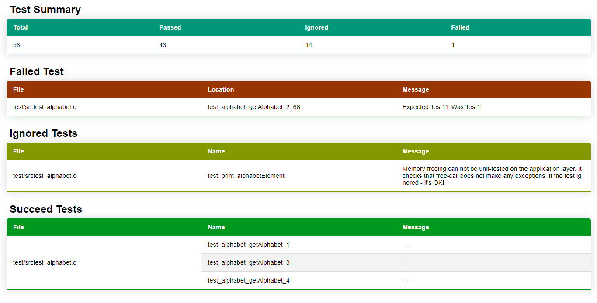

# Ceedling Plugin: Test Suite Report Log Factory

Generate one or more built-in test suite reports — JSON, JUnit XML, CppUnit XML, or HTML — or create your own.

# Plugin Overview

Test reports are handy for all sorts of reasons. Various build and reporting tools are able to generate, visualize, or otherwise process results encoded in handy container formats including JSON and XML.

This plugin generates one or more of up to four available test suite report formats:

1. JSON
1. JUnit XML
1. CppUnit XML
1. HTML

This plugin generates reports after test builds, storing them in your project `artifacts/` build path.

With a limited amount of Ruby code, you can also create your own report without creating an entire Ceedling plugin.

# _User Beware_

Test reports often lack well managed standards or even much documentation at all. Different revisions of the formats exist as do different flavors of the same version produced by different tools.

If a test report produced by this plugin does not work for your needs or is not recognized by your report processing tool of choice, well, sadly, this is not all that uncommon. You have at least two options:

1. Use a script or other tool to post-process the report into a format that works for you. You might be surprised how many of these hacks are commonly necessary and exist peppered throughout online forums. You can incorporate any such post-processing step by enabling the `command_hooks` Ceedling plugin (lower in the plugin list than this plugin) and configuring a Ceedling tool to run the needed transformation.
1. Use Ceedling's abilities plus features of this plugin (documented below) to generate your own test report with a minimal amount of Ruby code.

# Setup

Enable the plugin in your Ceedling project file by adding `report_tests_log_factory` to the list of enabled plugins.

```yaml
:plugins:
  :enabled:
    - report_tests_log_factory
```

All generated reports are written to `<build root>/artifacts/<context>`. Your Ceedling project file specifies `<build root>` as a required entry for any build. Your build's context defaults to `test`. Certain other test build plugins (e.g. GCov) provide a different context (e.g. `gcov`) for test builds, generally named after themselves. That is, for example, if this plugin is used in conjunction with a GCov coverage build, the reports will end up in a subdirectory other than `test/`, `gcov/`.

# Configuration

Enable the reports you wish to generate — `json`, `junit`, and/or `cppunit` — within the `:report_tests_log_factory` ↳ `:reports` configuration list.

```yaml
:report_tests_log_factory:
  # Any one or all four of the following...
  :reports:
    - json
    - junit
    - cppunit
    - html
```

Each report is written to a default filename within `<build root>/artifacts/<context>`:

* JSON: _tests_report.json_
* JUnit XML: _junit_tests_report.xml_
* CppUnit XML: _cppunit_tests_report.xml_
* HTML: _tests_report.html_

To change the output filename, specify it with the `:filename` key beneath the relevant report within the `:report_tests_log_factory` configuration block:

```yaml
:report_tests_log_factory:
  # Replace `<report>` with one of the available options above.
  # Each report can have its own sub-configuration block.
  :reports:
    - <report>
  :<report>:
    :filename: 'more_better_filename.ext'
```

# Built-in Reports

## Execution duration values

Some test reporting formats include the execution time (duration) for aspects of a test suite run. Various granularities exist from the total time for all tests to the time of each suite (per the relevant defition of a suite) to the time required to run individual test cases. See _CeedlingPacket_ for the details on time duration values.

Ceedling automatically gathers all the relevant durations. In fact, Ceedling itself performs the needed timing and arithmetric in all cases, except one. Individual test case exection time tracking is specifically a [Unity] feature (see its documentation for more details). If enabled and if your platform supports the time mechanism Unity relies on, Ceedling will automatically collect test case time values and make them available to reports.

To enable test case duration measurements, they must be enabled as a Unity compilation option. Add `UNITY_INCLUDE_EXEC_TIME` to Unity's compilation symbols (`:unity` ↳ `:defines`) in your Ceedling project file (below). This plugin and the core of Ceedling take care of the rest. Unity test case durations as reported by Ceedling default to 0 if this Unity compilation option is not configured.

```yaml
:unity:
  :defines:
    - UNITY_INCLUDE_EXEC_TIME
```

_Note:_ Most test cases are quite short, and most computers are quite fast. As such, Unity test case execution time is often reported as 0 milliseconds as the CPU execution time for a test case typically remains in the microseconds range. Unity would require special rigging that is inconsistently available across platforms to measure test case durations at a finer resolution.

[Unity]: https://github.com/ThrowTheSwitch/Unity

## JSON Format

[JSON] is “a lightweight data-interchange format.” JSON serializes common data structures into a human readable form. The format has several pros, including the ability for entirely different programming languages to ingest JSON and recreate these data structures. As such, this makes JSON a good report generation option as the result can be easily programmatically manipulated and put to use.

Something like XML is a general purpose structure for, well, structuring data. XML has enough formality that XML formats can be validated with general purpose tools plus much more. JSON is much more flexible but rather tied to the data it encodes. Small changes to a data structure can have big impacts.

The JSON this plugin generates uses an ad hoc set of data structures following no standard — though any other test framework outputting test results in JSON may look fairly similar.

### Example JSON configuration YAML

```yaml
:plugins:
  :enabled:
    - report_tests_log_factory

:report_tests_log_factory:
  :reports:
    - json
  # Default filename shown for completeness
  # `:json` block only needed to override default
  :json:
    :filename: tests_report.json
```

[JSON]: https://www.json.org/

### Example JSON test report

In the following example a single test file _TestUsartModel.c_ exercised four test cases. Two test cases passed, one test case failed, and one test case was ignored.

```sh
 > ceedling test:UsartModel
```

```json
{
  "FailedTests": [
    {
      "file": "test/TestUsartModel.c",
      "test": "testGetFormattedTemperatureFormatsTemperatureFromCalculatorAppropriately",
      "line": 25,
      "message": "Function TemperatureFilter_GetTemperatureInCelcius() called more times than expected."
    }
  ],
  "PassedTests": [
    {
      "file": "test/TestUsartModel.c",
      "test": "testGetBaudRateRegisterSettingShouldReturnAppropriateBaudRateRegisterSetting"
    },
    {
      "file": "test/TestUsartModel.c",
      "test": "testShouldReturnErrorMessageUponInvalidTemperatureValue"
    }
  ],
  "IgnoredTests": [
    {
      "file": "test/TestUsartModel.c",
      "test": "testShouldReturnWakeupMessage"
    }
  ],
  "Summary": {
    "total_tests": 4,
    "passed": 2,
    "ignored": 1,
    "failures": 1
  }
}
```

## JUnit XML Format

[JUnit] holds a certain position among testing tools. While it is an xUnit-style framework specific to unit testing Java, it has influenced how Continuous Integration build tools operate, and its [JUnit XML report format][junit-xml-format] has become something of a defacto standard for test reports in any language. The JUnit XML format has been revised in various ways over time but generally has more available documentation than some other formats.

[JUnit]: https://junit.org/
[junit-xml-format]: https://docs.getxray.app/display/XRAY/Taking+advantage+of+JUnit+XML+reports

### Example JUnit configuration YAML

```yaml
:plugins:
  :enabled:
    - report_tests_log_factory

:report_tests_log_factory:
  :reports:
    - junit
  # Default filename shown for completeness
  # `:junit` block only needed to override default
  :junit:
    :filename: junit_tests_report.xml
```

### Example JUnit test report

In the following example a single test file _TestUsartModel.c_ exercised four test cases. Two test cases passed, one test case failed, and one test case was ignored (a.k.a. “skipped” in JUnit lingo).

In mapping a Ceedling test suite to JUnit convetions, a Ceedling _test file_ becomes a JUnit _test suite_.

```sh
 > ceedling test:UsartModel
```

```xml
<?xml version="1.0" encoding="utf-8" ?>
<testsuites tests="4" failures="1" time="0.331">
  <testsuite name="test/TestUsartModel" tests="4" failures="1" skipped="1" errors="0" time="0.331">
    <testcase name="testGetBaudRateRegisterSettingShouldReturnAppropriateBaudRateRegisterSetting" time="0.000"/>
    <testcase name="testShouldReturnErrorMessageUponInvalidTemperatureValue" time="0.000"/>
    <testcase name="testGetFormattedTemperatureFormatsTemperatureFromCalculatorAppropriately" time="0.000">
      <failure message="Function TemperatureFilter_GetTemperatureInCelcius() called more times than expected." />
    </testcase>
    <testcase name="testShouldReturnWakeupMessage" time="0.000">
      <skipped />
    </testcase>
  </testsuite>
</testsuites>
```

## CppUnit XML Format

[CppUnit] is an xUnit-style port of the JUnit framework to C/C++. Documentation for its XML test report is scattered and not easily linked.

[CppUnit]: https://freedesktop.org/wiki/Software/cppunit/

### Example CppUnit configuration YAML

```yaml
:plugins:
  :enabled:
    - report_tests_log_factory

:report_tests_log_factory:
  :reports:
    - cppunit
  # Default filename shown for completeness
  # `:cppunit` block only needed to override default
  :cppunit:
    :filename: cppunit_tests_report.xml
```

### Example CppUnit test report

In the following example a single test file _TestUsartModel.c_ exercised four test cases. Two test cases passed, one test case failed, and one test case was ignored.

In mapping a Ceedling test suite to CppUnit convetions, a CppUnit test name is the concatenation of a Ceedling test filename and a test case function name. As such, a test filename will appear in the report a number of times equal to the number of test cases it holds. Test IDs are merely an incrementing count useful to uniquely identifying tests by number; no ordering or convention is enforced in generating them.

```sh
 > ceedling test:UsartModel
```

```xml
<?xml version="1.0" encoding="utf-8" ?>
<TestRun>
  <FailedTests>
    <Test id="1">
      <Name>test/TestUsartModel.c::testGetFormattedTemperatureFormatsTemperatureFromCalculatorAppropriately</Name>
      <FailureType>Assertion</FailureType>
      <Location>
        <File>test/TestUsartModel.c</File>
        <Line>25</Line>
      </Location>
      <Message>Function TemperatureFilter_GetTemperatureInCelcius() called more times than expected.</Message>
    </Test>
  </FailedTests>
  <SuccessfulTests>
    <Test id="2">
      <Name>test/TestUsartModel.c::testGetBaudRateRegisterSettingShouldReturnAppropriateBaudRateRegisterSetting</Name>
    </Test>
    <Test id="3">
      <Name>test/TestUsartModel.c::testShouldReturnErrorMessageUponInvalidTemperatureValue</Name>
    </Test>
  </SuccessfulTests>
  <IgnoredTests>
    <Test id="4">
      <Name>test/TestUsartModel.c::testShouldReturnWakeupMessage</Name>
    </Test>
  </IgnoredTests>
  <Statistics>
    <Tests>4</Tests>
    <Ignores>1</Ignores>
    <FailuresTotal>1</FailuresTotal>
    <Errors>0</Errors>
    <Failures>1</Failures>
  </Statistics>
</TestRun>
```

## HTML Format

This plugin creates an adhoc HTML page in a single file.

### Example HTML configuration YAML

```yaml
:plugins:
  :enabled:
    - report_tests_log_factory

:report_tests_log_factory:
  :reports:
    - html
  # Default filename shown for completeness
  # `:html` block only needed to override default
  :html:
    :filename: tests_report.html
```

### Example HTML test report



# Creating Your Own Custom Report

Creating your own report requires three steps:

1. Choose a directory to hold your report Ruby code and add it to your `:plugins` ↳ `:load_paths` configuration.
1. Create a Ruby file in the directory from (1) per instructions that follow.
1. Enable your new report in your `:report_tests_log_factory` Ceedling configuration.

## Custom report configuration

Configuration steps, (1) and (3) above, are documented by example below. Conventions simplify the Ruby programming and require certain naming rules that extend into your project configuration.

```yaml
:plugins:
  :load_paths:              # Paths can be relative or absolute
    - scripts/              # Add <build root>/scripts to Ruby's load paths
  :enabled:
    - report_tests_log_factory

:report_tests_log_factory:
  :reports:
    - fancy_shmancy         # Your custom report must follow naming rules (below)
```

## Custom `TestsReporter` Ruby code

To create a custom report, here's what you gotta do:

1. Create a Ruby file in your configured additional load path named `<custom_report>_tests_reporter.rb`. `<custom_report>` should be in lower case and use underscores if you wish to seperate words (i.e. snakecase).
1. The Ruby code itself must subclass an existing plugin class, `TestsReporter`.
1. Your new subclass must be named `<CustomReport>TestsReporter` where `<CustomReport>` is the camelcase version of your report name from (1).
1. Fill out up to four methods in your custom `TestsReporter` subclass:
   * `setup()`
   * `header()` (optional)
   * `body()`
   * `footer()` (optional)

Overriding the default filename of your custom report happens just as it does for the built-in reports. In fact, apart from the custom load path, the built-in reports documented above use the same mechanisms as a custom report. These Ruby files can and should be used as references.

You may access `:report_tests_log_factory` configuration for your custom report using a handy utility method documented in a later section.

### Sample `TestReporter` custom subclass

The following code creates a simple, dummy report of the _FancyShmancy_ variety (note the name correspondence to the example configuration YAML above).

```ruby
# Must include this `require` statement
require 'tests_reporter'

# Your custom class must:
#  1. Follow the naming convention <CustomReport>TestsReporter where 
#     <CustomReport> corresponds to the <custom_report> entry in your 
#     `:report_tests_log_factory` configuration.
#  2. Sublcass `TestsReporter`.
class FancyShmancyTestsReporter < TestsReporter

  # Must include a method `setup()` that:
  #  1. Calls `super()` with a default filename for the custom report.
  #     (No convention or limitations on filenames.)
  #  2. Includes any needed instance variables.
  #     (`setup()` is effectively your constructor.)
  def setup()
    super( default_filename: 'fancy_shmancy_tests_report.xml' )
  end
  
  # If your report includes a header section, fill out this method.
  # If no header in your report, this method is not needed in this file at all.
  def header(results:, stream:)
    stream.puts( '<?xml version="1.0" encoding="utf-8" ?>' )
    stream.puts( "<FancyShmancy TestCount=#{results[:counts][:total]}>" )
  end

  # Process test results into report records
  def body(results:, stream:)
    results.each do |result|
      result[:collection].each do |item|
        write_test( item, stream )
      end
    end    
  end

  # If your report includes a footer section, fill out this method.
  # If no footer in your report, this method is not needed in this file at all.
  def footer(results:, stream:)
    stream.puts( "</FancyShmancy>" )
  end

  # If you want to break up your custom reporting code, create all the private 
  # methods you wish and call them as needed from `setup()`, `header()`, 
  # `body()`, and `footer()`.

  private

  # A simple helper method for a simple test report entry.
  # This methid is not required by a custom `TestReporter` subclass.
  def write_test(item, stream)
    stream.puts( "  <Test><Name>#{item[:test]}</Name></Test>" )
  end

end
```

### Plugin hooks & test results data structure

See [_PluginDevelopmentGuide_][custom-plugins] for documentation of the test results data structure (i.e. the `results` method arguments in above sample code).

See this plugin's built-in `TestsReports` subclasses — `json_tests_reporter.rb`, `junit_tests_reporter.rb`, and `cppunit_tests_reporter.rb` — for examples of using test results.

[custom-plugins]: ../docs/PluginDevelopmentGuide.md

### `TestsReporter` utility methods

#### Configuration access: `fetch_config_value(*keys)`

You may call the private method `fetch_config_value(*keys)` of the parent class `TestReporters` from your custom subclass to retrieve configuration entries.

This method automatically indexes into `:report_tests_log_factory` configuration to extract any needed configuration values for your custom report. If the configuration keys do not exist, it simply returns `nil`. Otherwise, it returns the hash, list, string, boolean, or numeric value for the specified key walk into your report's configuration.

`fetch_config_value(*keys)` expects a list of keys and only accesses configuration beneath `:report_tests_log_factory` ↳ `:<custom_report>`.

##### Example _FancyShmancy_ configuration + `TestsReporter.fetch_config_value()` calls

```yaml
report_tests_log_factory:
  :fancy_shmancy:
    # Hypothetical feature to standardize test names before writing to report
    :standardize:
      :names: TRUE
      :filters:
        - '/^Foo/'
        - '/Bar$/'
```

```ruby
# Calls from within FancyShmancyTestsReporter

fetch_config_value( :standardize, :names ) => true

fetch_config_value( :standardize, :filters ) => ['/^Foo/', '/Bar$/']

fetch_config_value( :does, :not, :exist ) => nil
```
